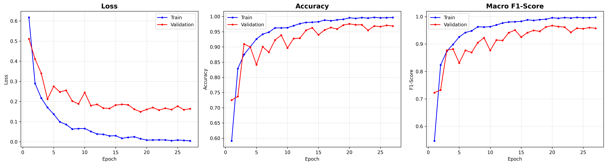
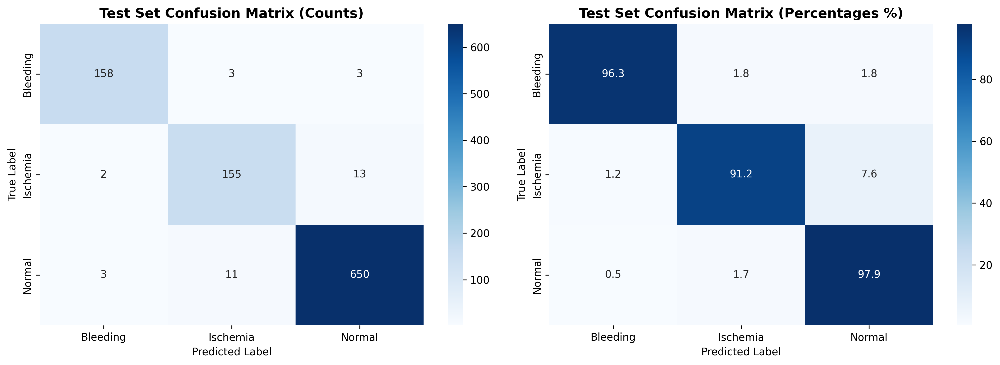
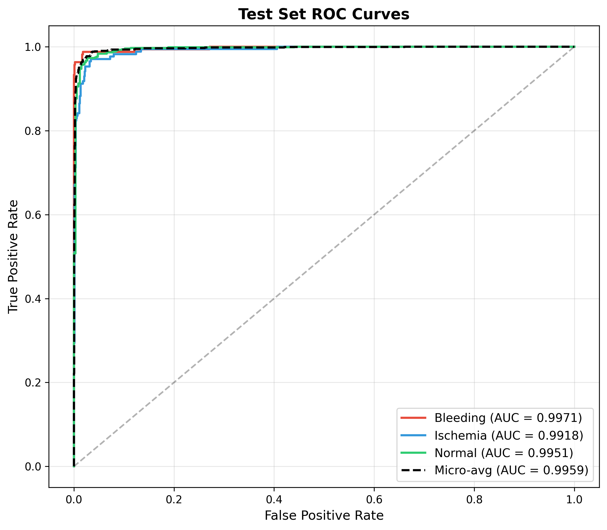
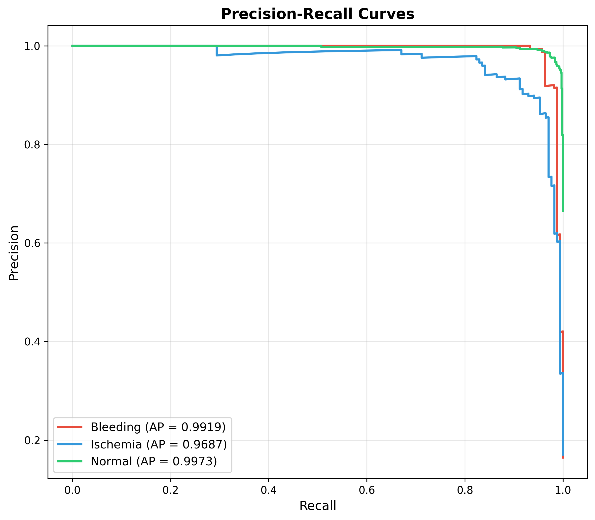
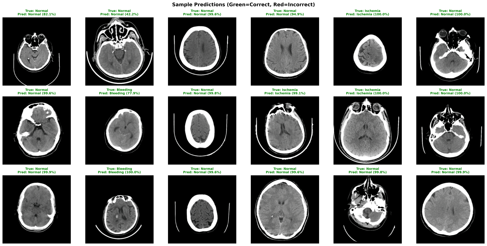
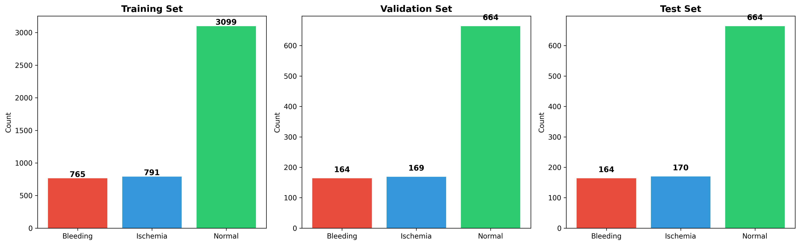

# Brain Stroke CT Classification

Classification of brain CT images into **hemorrhagic stroke (bleeding)**, **ischemic stroke**, and **normal** categories using deep learning and traditional ML approaches.

## Models

- **ResNet-50** — End-to-end fine-tuned with ImageNet transfer learning
- **Logistic Regression** — On ResNet-50 extracted features
- **Random Forest** — On ResNet-50 extracted features
- **SVM (RBF kernel)** — On ResNet-50 extracted features

## Results

### ResNet-50 (Fine-tuned)

| Metric | Value |
|--------|-------|
| Overall Accuracy | 96.49% |
| Macro F1-Score | 95.28% |
| Cohen's Kappa | 0.9299 |
| Micro-Average AUC | 0.9959 |

#### Per-Class Performance

| Class | Precision | Recall | F1-Score | AUC |
|-------|-----------|--------|----------|-----|
| Bleeding | 96.93% | 96.34% | 96.64% | 0.9971 |
| Ischemia | 91.72% | 91.18% | 91.45% | 0.9918 |
| Normal | 97.60% | 97.89% | 97.74% | 0.9951 |

### Traditional ML Classifiers

Results using ResNet-50 as a feature extractor (2048-d features) with traditional classifiers. Run `train_classifiers.py` to generate these results.

### Training Curves



### Confusion Matrix



### ROC Curves



### Precision-Recall Curves



### Sample Predictions



## Dataset

The [Brain Stroke CT Dataset](https://www.kaggle.com/datasets) contains 6,650 brain CT images across three classes:

| Class | Images | Percentage |
|-------|--------|------------|
| Bleeding (Hemorrhagic) | 1,093 | 16.4% |
| Ischemia (Ischemic) | 1,130 | 17.0% |
| Normal | 4,427 | 66.6% |



Data was split 70/15/15 (train/val/test) with stratified sampling.

## Approach

- **Architecture:** ResNet-50 with ImageNet-V2 pretrained weights
- **Class imbalance handling:** Weighted random sampling + class-weighted cross-entropy loss
- **Augmentation:** Random flip, rotation (+/-15 deg), affine translation, color jitter
- **Optimizer:** AdamW (lr=1e-4, weight_decay=1e-4)
- **Scheduler:** Cosine annealing
- **Early stopping:** Patience of 7 epochs on validation macro F1
- **Training time:** ~72 minutes (27 epochs, best at epoch 20)

## Usage

### Requirements

```
torch
torchvision
numpy
pandas
matplotlib
seaborn
scikit-learn
Pillow
tqdm
```

### Training

```bash
# Fine-tune ResNet-50
python train_resnet.py

# Train traditional classifiers (Logistic Regression, Random Forest, SVM)
python train_classifiers.py
```

ResNet-50 results are saved to `results/`. Classifier results are saved to `results/classifiers/`.

## Project Structure

```
.
├── train_resnet.py              # ResNet-50 fine-tuning script
├── train_classifiers.py         # Logistic Regression, Random Forest, SVM script
├── research_paper.md            # Full research paper with methodology and analysis
├── Brain_Stroke_CT_Dataset/     # Dataset (not included in repo)
│   ├── Bleeding/
│   ├── Ischemia/
│   ├── Normal/
│   └── External_Test/
└── results/                     # Training outputs
    ├── best_model.pth           # Best model weights
    ├── results.json             # ResNet-50 metrics and training history
    ├── training_curves.png
    ├── confusion_matrix_test.png
    ├── confusion_matrix_val.png
    ├── roc_curves_test.png
    ├── pr_curves_test.png
    ├── class_distribution.png
    ├── sample_predictions.png
    └── classifiers/             # Traditional ML results
        ├── classifier_results.json
        ├── model_comparison.png
        ├── per_class_f1_comparison.png
        ├── cm_*.png             # Confusion matrices
        ├── roc_*.png            # ROC curves
        └── pr_*.png             # Precision-recall curves
```

## License

This project is for academic and research purposes.
